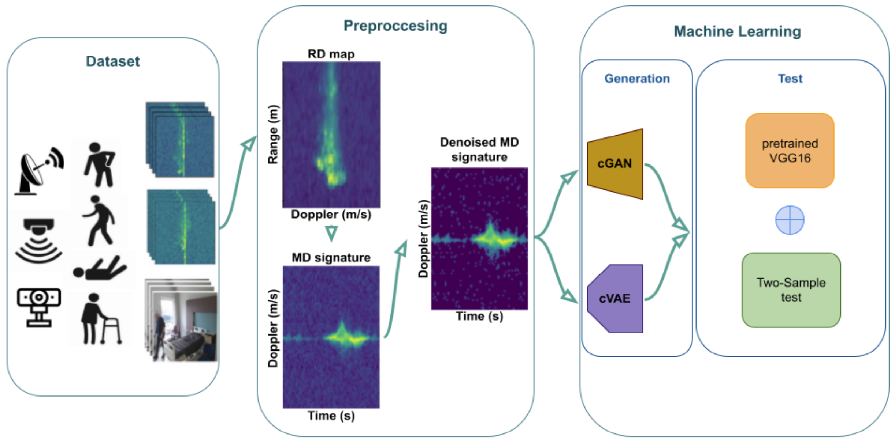

# Neural Networks and Deep Learning Project: Patient Activity Recognition

Healthcare is facing a major challenge in monitoring and surveillance of patients, as a result of a shortage of healthcare personnel. One solution to this problem is the use of video systems for surveillance, however cameras can struggle to capture subjects’ movements in low light conditions or if they are obscured by objects, and video surveillance can be invasive in situations where privacy is of high importance. Radio frequency (RF) sensors can be an effective alternative to video cameras, as they are more cost-efficient, less energy-intensive, and, most importantly, non-invasive.
In recent years, there have been numerous advancements in Machine Learning (ML), which have enabled the use of algorithms to recognize human movements based on both RF and video signals. DNNs have been found to be particularly effective in these types of tasks, as they can achieve good accuracy in motion recognition and classification.
The challenge with Deep Neural Networks (DNNs) in the healthcare industry is obtaining sufficient training data due to privacy concerns.

In this work, we present machine learning approaches for generating synthetic micro-doppler (MD) signatures using data obtained from a Frequency Modulation Continuous Wave (FMCW) radar at 77 GHz, as well as a video camera, which is utilized solely for validation and annotation purposes. The proposed methods include the use of Conditional Generative Adversarial Networks (cGANs) and Conditional Variational Autoencoders (cVAEs) to generate multiple MD signature images.

## Processing Pipeline

In this paper, we present two deep learning-based ap- proaches, Conditional Variational Autoencoders (cVAEs) and Conditional Generative Adversarial Networks (cGANs), for the task of synthetic micro-Doppler signatures generation.
The processing pipeline for both approaches consists of several stages:

- **Data Preparation**
- **Model Training**
- **Model Evaluation**

